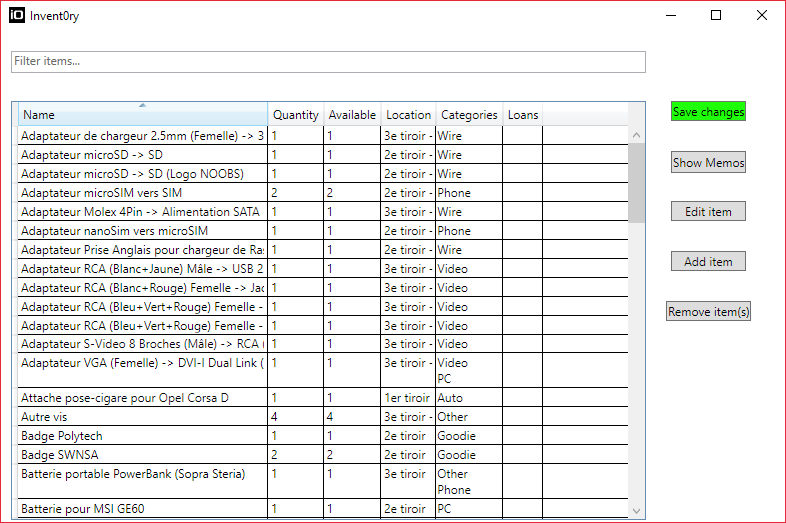
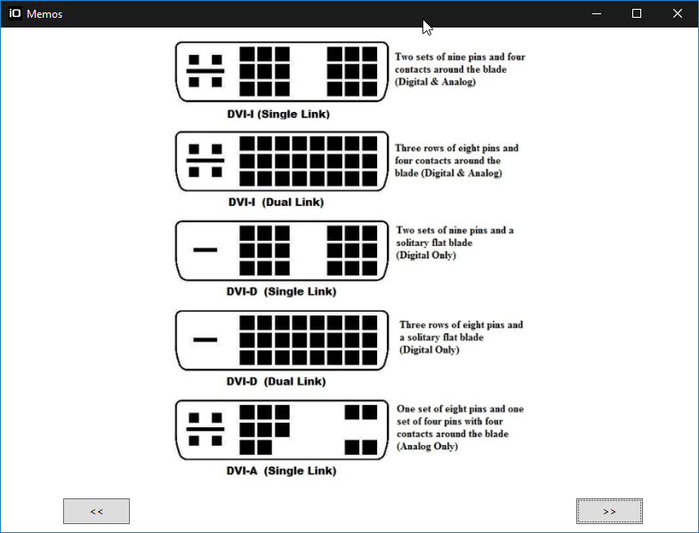
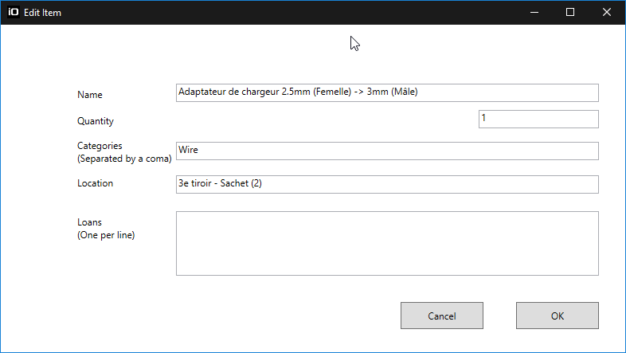

# Invent0ry

Just a simple app to help me list stuff like wires

## Features

* Add/Edit/Remove items
* Filter items by name
* Sort items
* Display some "memo" pictures

## Screenshots

## Notes

The item list is saved in this path by default: ``Documents\SkyNetLabs\invent0ry`` as ``inventory.json``. This path can be changed.

If you want to put memo pictures you have to put them in the same directory, all main extensions are supported (.png, .jpg, etc.)